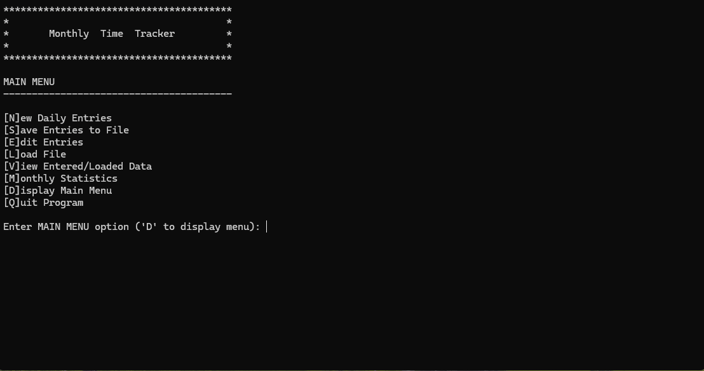

# FALL 2025 Assignment 03 - Methods, Arrays, and File I/O
__Weight:__ 15% of final mark

__Submission requirements:__ 
1. Download and extract the [starter code](./Assignment3.zip).
2. Add the missing code as per the requirements below.
3. On or before the deadline, commit a compressed file containing your entire .NET 8 Visual Studio 2022 project to BrightSpace. It is your responsibility to ensure that your work is submitted correctly. ___Work not uploaded to BrightSpace will not be graded___.

## Context
As a student and gamer, you want to get a clearer picture of how much time you're spending gaming each day. You decide to build a program that helps track your gaming time and provides basic stats like your average gaming time per day, and your highest and lowest play days.

### Requirements
Your program must meet the following requirements:

- Must allow the user to **enter** the minutes spent gaming per day
- Must allow the user to **save** their entered daily values to a file
- Must allow the user to **load** a previously saved data file
- Must allow the user to **view** and **edit** previously entered values
- Must allow the user to view simple **analysis** of the currently entered/loaded data:
  - Average minutes
  - Highest daily amount
  - Lowest daily amount
  - Chart of daily values for the current month

## Implementation Details 

You have been provided with a [starter project](./Assignment3.zip) for this assignment. Your job will 
be to complete the missing requirements where indicated. There are a number of tasks that are all identified by 
`// TODO: ` comments throughout the `Program.cs` file.

  - Tip: when you click the link above, there is a small download button on the right side of the screen that looks like a downward-facing arrow:
  

The program makes use of a main menu for top-level options and a sub-menu for the analysis options. The program should continue to run until the user chooses to quit. Ask the user to supply the desired filename when saving a new monthly file. When entering new daily data, the user will need to enter values for one month only and provide a value for each day (zero means no gaming that day). Duplicate entry dates are not allowed.

Use two parallel arrays for storing the data in your program (one for date values and one for corresponding daily values). Keep an accurate record count for the number of days loaded/entered. Dates must be in valid YYYY-MMM-DD (e.g., 2025-JUL-14) format. Values must be zero or positive.

The program should never crash and must deal with errors gracefully.


### File Format
The format of the data files should be as follows (you may assume valid file format for input):

- The data file must include a header row: `Date,Minutes`
- Dates must be in ascending order and in format YYYY-MMM-DD
- Minutes should be recorded to two decimal places

```csv
Date,Minutes
2025-JUL-01,45.00
2025-JUL-02,0.00
2025-JUL-03,180.50
2025-JUL-04,90.25
... (additional rows left out to save space)
2025-JUL-31,0.00
```

_Excerpt of sample data file format_

## Required Methods

You will use a **modular** approach when constructing this program. Ensure that, at a minimum, the following methods are present and used:

### Difficulty 1 (Easy)
- `void DisplayMainMenu()` --> displays the main menu options
- `void DisplayAnalysisMenu()` --> displays the analysis menu options
- `string Prompt(string promptMessage)` --> displays the prompt message and returns user-entered string (allow empty string to be returned)
- `double PromptDouble(string promptMessage)` --> displays the prompt message and returns user-entered `double` (ensure that the program does not crash and **always** returns a valid double value)
- `double CalculateLargest(double[] values, int countOfEntries)` --> returns the value of the _highest_ amount in the values array
(requires that the original ordering of the arrays be retained)
- `double CalculateSmallest(double[] values, int countOfEntries)` --> returns the value of the _lowest_ amount in the values array
(requires that the original ordering of the arrays be retained)
- `double CalculateMean(double[] values, int countOfEntries)` --> returns the mean average of the _daily_ values; include all entered values (yes, even days with zero minutes)
### Difficulty 2 (Moderate)
- `int EnterDailyValues(string[] dates, double[] values)` --> allows the user to enter the daily values into the arrays; returns the number of entries entered
- `int LoadFromFile(string filename, string[] dates, double[] values)` --> loads the records from a file into the associative arrays used by the program; returns the record count (i.e. how many days of data were loaded) 
- `void SaveToFile(string filename, string[] dates, double[] values, int countOfEntries)` --> writes the associative array data to a file in the correct format 
- `void DisplayEntries(string[] dates, double[] values, int countOfEntries)` --> displays the current entered/loaded entries in a formatted table (i.e. ensure that proper columns and alignment are used). __You must use a `for` loop to loop through the arrays and produce the display__ 
### Difficulty 3 (Challenging)
- `void EditEntries(string[] dates, double[] values, int countOfEntries)` --> allows the user to view all current
entries and choose one to edit (i.e. overwrite)
### Difficulty 4 (Extreme)
- `void DisplayChart(string[] dates, double[] values, int countOfEntries)` --> displays a chart of the data in the following sparkline format using text blocks.

    ```text
    === Game Time Overview ===

    2025-JUL-01 | █
    2025-JUL-02 | 
    2025-JUL-03 | ██████
    2025-JUL-04 | ███
    ... (etc.)
    ```

    - Use the character `█` to represent each 30-minute increment (e.g., 90 minutes = 3 blocks)
    - Each date's bar should appear beside the label in the format shown
    - Traverse the arrays and scale accordingly
    - This is a challenge and should be tackled after basic functionality is complete
    - In the chart above, the ellipsis (...) is used for demonstration only, include all days in your implementation.

------

__Aside from what’s been presented in this document, do not make **any** assumptions. Seek clarity from your instructor if you do not understand something in this document.__

------

## Coding Requirements
- A C# comment block at the beginning of the source file describing the purpose, author, and last modified date of the program
- Use two parallel arrays (`string[]` for dates, `double[]` for minutes)
- You must **not** use built-in methods for finding the average, high, and low values in arrays
- Use defensive programming where necessary
- Ensure graceful handling of exceptions
- All methods must be defined as `static` methods
- Include summary comments for **all** defined methods (these must be complete and include `param` and `returns` where appropriate)
- Follow the coding standards as specified on BrightSpace.


### Sample Runs

#### Sample Program Run
_NOTE: the sample runs do not demonstrate exception handling, ensure your program handles exceptions gracefully and does not crash._

#### Enter values, perform analysis, and save file


#### Load file and edit entries


## Sample Data File

A sample file has been provided: [`2025-JUL-GameTime.csv`](./2025-JUL-GameTime.csv)

## Submission
Upload your compressed solution to BrightSpace before the deadline. Ensure that your solution follows the best coding and style practices, as your instructor has shown you in class. Failed adherence to the prescribed style guidelines may result in lost marks. __Your program must compile; a program that fails to compile will not be graded.__

_NOTE: submit early and often to receive feedback from your instructor prior to the deadline. Your instructor will not be providing feedback for every commit every day. However, the earlier and more often you commit, the greater the chances of your instructor reviewing your work and providing constructive feedback that you can act on before the deadline._

## Rubric [24 Marks Total]
| Criteria |  Good (3 marks) | Acceptable (2 marks) | Needs Work (1 mark) | Unsatisfactory (0 marks)
|-|-|-|-|-|
|Difficulty 1 Methods|All methods are implemented with expected functionality including specified parameters & return values, and exception handling where needed.|Most methods are implemented with expected functionality including specified parameters & return values, and exception handling where needed.|Fewer than half of the methods have required functionality.|Not attempted or unable to compile.|
|Difficulty 2 Methods|All methods are implemented with expected functionality including specified parameters & return values, and exception handling where needed.|Most methods are implemented with expected functionality including specified parameters & return values, and exception handling where needed.|Fewer than half of the methods have required functionality.|Not attempted or unable to compile.|
|Difficulty 3 & 4 Methods|Both methods are implemented with expected functionality including specified parameters & return values, and exception handling where needed.|Difficulty 3 method implemented with expected functionality including specified parameters & return values, and exception handling where needed.|Difficulty 3 method is implemented with minor errors.|Not attempted or unable to compile.|
|Array Management|2 parallel arrays are implemented, logical count is kept accurately, and arrays traversed correctly.|1-2 minor errors in array algorithms.|1 array was used or count not maintained.|Fewer than 2 arrays were used and count was not maintained.|
|File I/O|Read/write as per program specs, required file format was used, defensive programming was implemented and program does not crash.|Minor errors in file format, or program crashes during file I/O in some cases.|Significant issues with file format, defensive programming is not applied.|Errors during file I/O crash program, required format isn't implemented, or code not written.|
| Documentation |All methods correctly & fully documented in XML format.|Most methods are documented.|Fewer than half of methods are documented.|Documentation is not completed.|
| Correctness | All tests pass. | Most tests pass. | Some tests pass. | No tests pass.
| Best practices | Code follows course best practices including good naming conventions, properly aligned output, opening comment block, and appropriate use of comments. | 1-2 minor errors or violations. | 3+ errors or standard violations. | No alignment, documentation, or appropriate names.

Generative AI is not permitted for this assignment: suspected uses of academic misconduct will be investigated following the NAIT Academic Integrity policy and Academic Misconduct procedure and may result in a grade of zero.
